# Flib v1.1
Classes for managing windows and creating OpenGL contexts (for Windows and Linux)
Automatic OpenGL functions loading
Wrapper classes for OpenGL objects (Texture, FrameBuffer, Shader etc)
Template classes (Vectors, Matrices, Polar vectors, Delegates)

## Compilation

The library requires OpenGL development library to compile
On Linux systems this means you need glx development library (e.g. from `mesa-common-dev`) \
Executing `make` in the `src` folder compiles the library.
Building only the static or dynamic linkage can be done using `make dynamic` and `make static`. \
To compile the tests call `make all` in the `test` folder.

Requirements: The library core requires only OpenGL 3.0 to work. OpenGL 4.4 preferred for more efficient implementations. Some tests use compute shaders and therefore require OpenGL 4.3. Tested all tests on Windows and Linux X11.

## Troubleshooting

When compiling on Linux systems the following errors may arise

| Symptom | Cause | Solution | Command |
| ------- |:-----:|:--------:| -------:|
| GL/glx.h not found | glx not installed | Install glx | `sudo apt-get install mesa-common-dev` |
| libGL.so not found | OpenGL not updated | Install/Update OpenGL | `sudo apt-get install libgl1-mesa-dev` or/then `sudo ldconfig` |

Please note that the actual command may differ on your system,
refer to your distribution's forum how to install the required
development libraries

## API Documentation

The source code uses selfdocumentation in doxygen style, compiled html version can be found [here](http://makom789.web.elte.hu/docs/index.html)
## Automatic testing
Testing done via my [AutoTester](https://github.com/Frontier789/AutoTester)

## Citation
The following public domain libraries are used by Flib:
<ol>
	<li>
		
stb (http://github.com/nothings/stb and http://nothings.org)

		<ul type="*">
			<li>stb_image.h</li>
		</ul>
		<ul type="*">
			<li>stb_image_write.h</li>
		</ul>
		<ul type="*">
			<li>stb_image_resize.h</li>
		</ul>
		<ul type="*">
			<li>stb_truetype.h</li>
		</ul>
	</li>
	<li>
		
jpeg (https://code.google.com/p/jpeg-compressor/)

		<ul type="*">
			<li>jpge.h</li>
			<li>jpge.cpp</li>
		</ul>
	</li>
	<li>
		
PicoSHA2 (https://github.com/okdshin/PicoSHA2)

		<ul type="*">
			<li>picosha2.h</li>
		</ul>
	</li>
</ol>

## Gallery
Screenshots of demos from the `test` folder.
|               |               |
:-----:|:----:
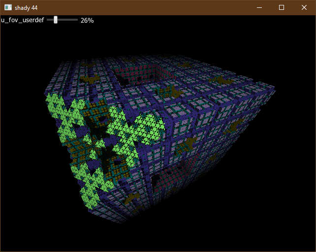 Modulated Menger Sponge| 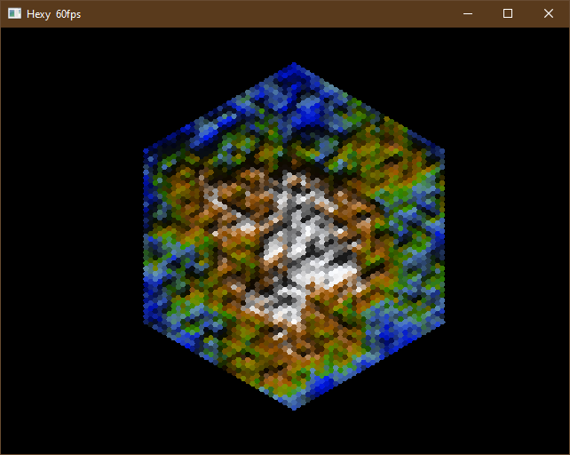 Hexagon terrain generator
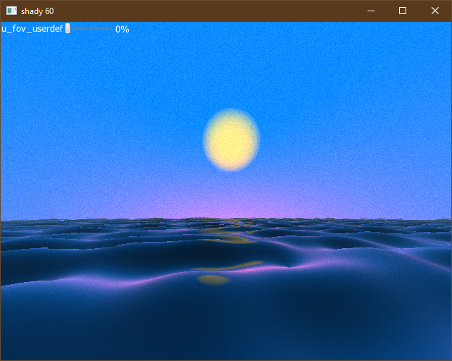 First attempt on water| 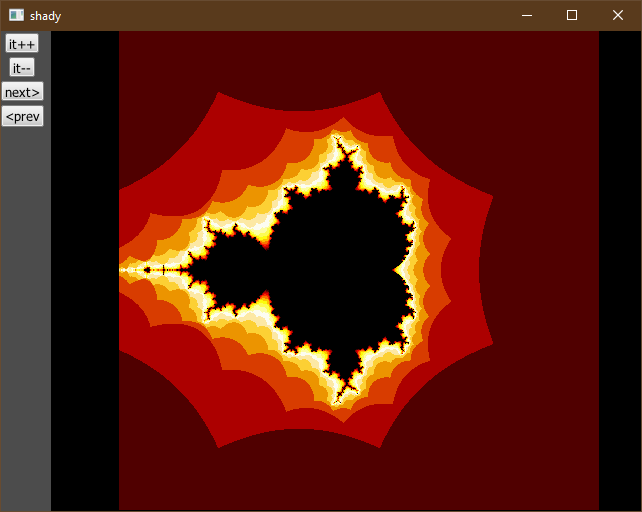 Taxicab Mandelbrot set 
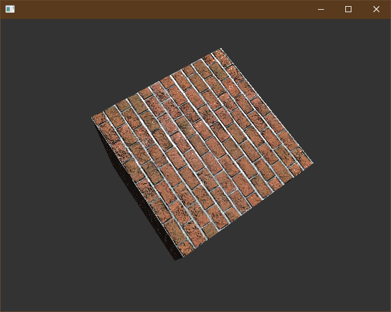 Texmapped Phong| 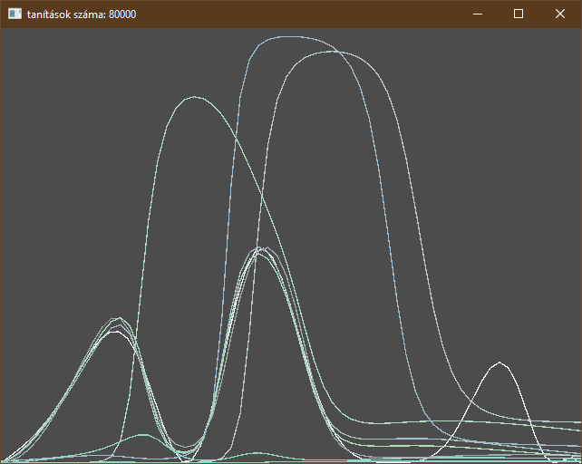 NN + Evolutionary algorithm
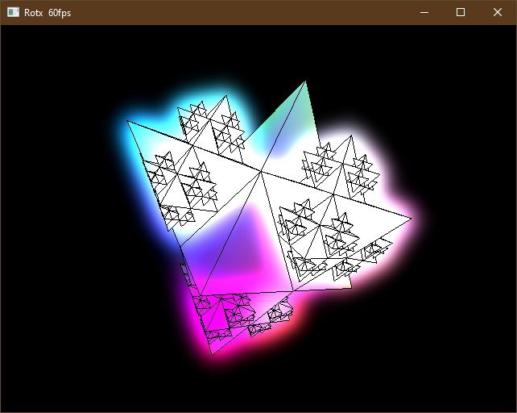 Bloom on fractal| 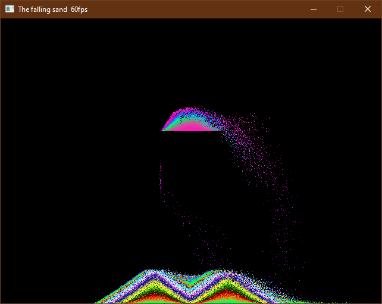 Large particle system sand
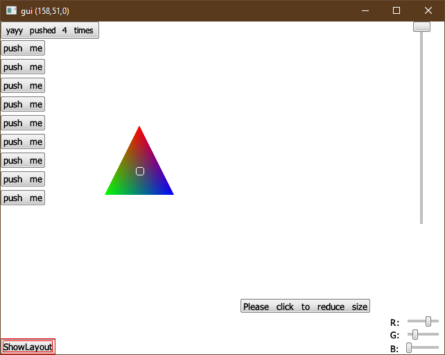 Dynamic GUI test| 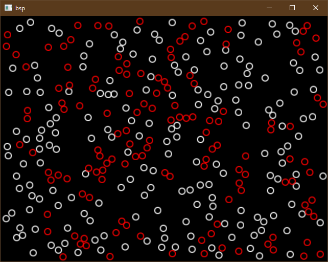 Binary space Partitioning collision
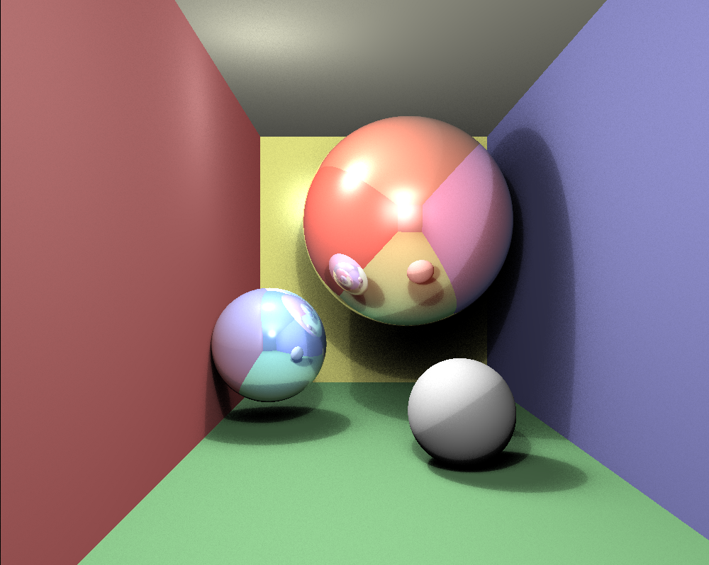

Raytraced balls

